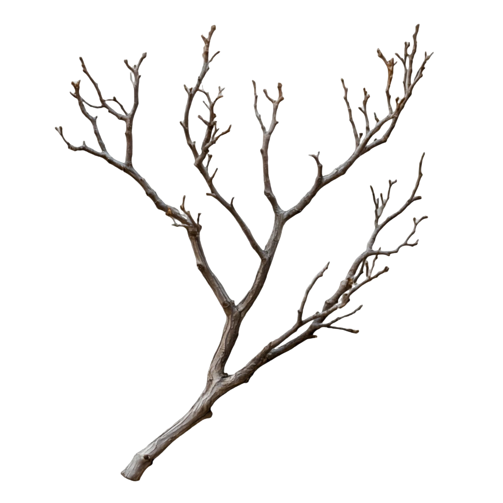
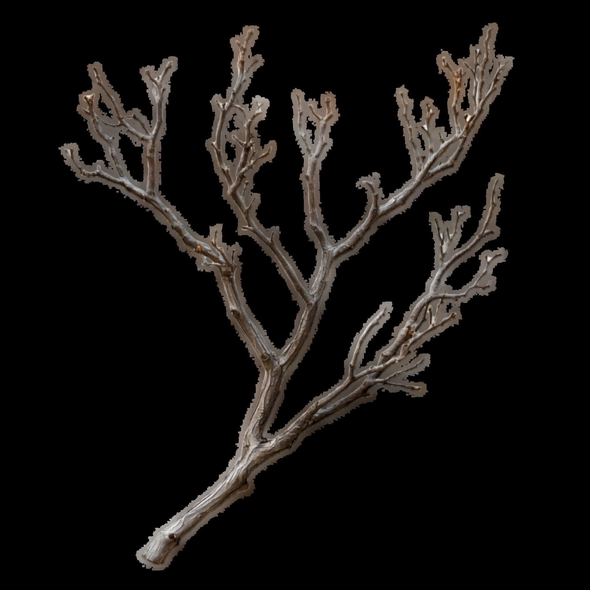
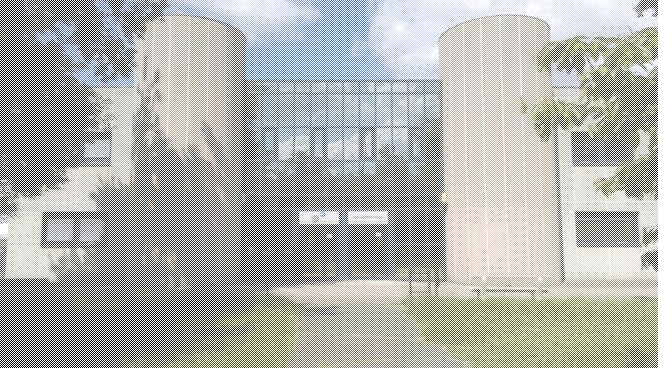

# Ditherpunk: retour au monochrome

## 1 La bibliothèque image

### Question 2

- Pour ouvrir une image depuis un fichier, on utilise la fonction image::open(), qui retourne un type DynamicImage. 

- Pour obtenir l'image au format RGB, on utilise la fonction to_rgb8 sur l'image récupérer
```rs
let img_rgb = img.to_rgb8();
```

Pour convertir l'image, on utilise la ligne de commande :

cargo run -- img/img1.png seuil


### Question 3

Pour save l'image, on utilise :

```rs
img_rgb.save("img/question3.png")?;
```

Avant :

</img>

Après :

</img>

On peut que sur l'image de base avec un canal alpha (transaparence), cette transparence sera perdue lorsque l’image est convertie en Rgb8. Cela signifie que toute zone transparente dans l'image d'origine sera rendue avec une couleur  généralement noire, car le format Rgb8 ne gère pas les canaux alpha.

## Question 4

Pour récupérer la couleur du pixel on utilise ceci :

```rs
let pixel = img_rgb.get_pixel(32, 52);
```

Couleur du pixel (32, 52) : Rgb([0, 0, 0])

Et après on a juste a l'afficher dans le terminal

## Question 5

Pour mettre un pixel sur deux en blanc, on parcours les pixel en hauteur et en largeur, et on met les pixels pair en blanc :

```rs
for y in 0..img2_rgb.height() {
        for x in 0..img2_rgb.width() {
            if (x + y) % 2 == 0 {
                img2_rgb.put_pixel(x, y, WHITE);
            }
        }
    }
```

Après avoir mis un pixel sur deux, l'image est toujours reconnaissable 

Avant :

</img>

Après :

</img>

## 2 Passage en monochrome par seuillage